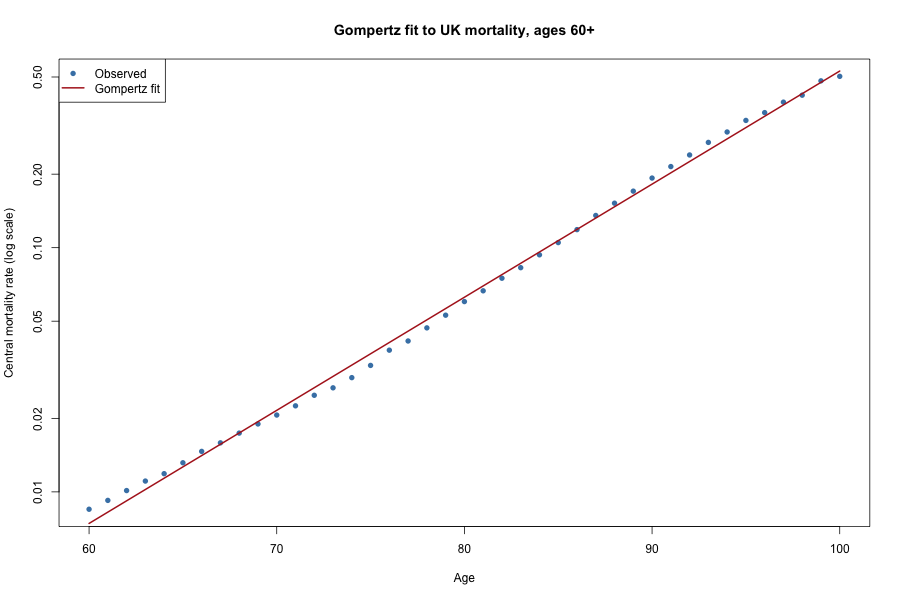
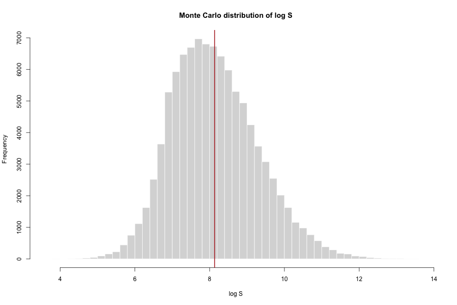

# Estimating an Inheritance with a Markov + Monte Carlo Model

A statistical model that estimates how much money a person will inherit when a
single stock investment is sold on the day the owner dies. Built for my university 
*Markov Processes* module and rebuilt here as a clean, reproducible project.

---

## The problem

A 60-year-old has **£1,000** invested in one FTSE-100 company. The shares are
held until he dies, sold that day, and the proceeds passed to his daughter. How
much should she expect to inherit, and how uncertain is that figure?

Two sources of randomness drive the answer:

1. **How long he lives** (the number of years `N`).
2. **How the share price moves each year** (the yearly return `X_i`).

Writing the final value as a product of yearly growth factors and taking logs:

```
log S = log S0 + sum_{i=1}^{N} X_i        where  X_i = log(S_i / S_{i-1})
```

So the inherited sum depends on a *random number* of *random* yearly returns. A
classic Markov-style setup, solved by simulation.

---

## Approach

| Step | What it models | Method |
|------|----------------|--------|
| 1 | `N`, remaining years of life | **Gompertz distribution** fitted to UK mortality data |
| 2 | `X_i`, yearly log-returns | **Normal distribution**, parameters via the method of percentiles |
| 3 | Distribution of `log S` | **Monte Carlo** simulation (100,000 runs) |

**Why Gompertz?** Human mortality risk rises roughly exponentially with age.
Gompertz is built for exactly that, which is why it is the standard choice in
actuarial work. Exponential (constant risk, memoryless) and Weibull (designed
for component failure) do not match human survival as well.

---

## Repository structure

```
.
├── README.md
├── LICENSE
├── .gitignore
├── data/
│   └── uk_life_table.csv        # UK national life table (age, mx, qx, lx, dx, ex)
├── R/
│   └── markov_inheritance.R     # full analysis, runs end to end
├── figures/                     # charts written by the script
└── report/                      # written report (PDF/markdown)
```

---

## How to run

```r
install.packages("quantmod")   # one-time, for the stock data pull
```

```bash
# from the repository root
Rscript R/markov_inheritance.R
```

The script prints the parameter estimates and summary statistics, and writes
two charts to `figures/`. Part 2 pulls Tesco PLC prices live from Yahoo Finance
via `quantmod` (LSE ticker `TSCO.L`), so an internet connection is needed when
it runs. No manual data file is required.

---

## Results

Run on Tesco (`TSCO.L`) dividend-adjusted prices, 1984-2024 (36 yearly returns).

| Quantity | Value |
|----------|-------|
| Gompertz parameters `b`, `eta` | 0.007426, 0.10664 |
| Life expectancy at 60 (model vs life table) | 22.23 yrs (matches) |
| Expected remaining lifetime `E[N]` | 21.70 years |
| Yearly log-return `mu`, `sigma` | +0.0564, 0.2202 |
| `E[log S]` (Monte Carlo vs closed form) | 8.1322 vs 8.1322 |
| `Var[log S]` (Monte Carlo vs closed form) | 1.3217 vs 1.3174 |
| **Median inherited sum** | **£3,090** |
| Mean inherited sum | £7,367 |
| 90% interval for the inherited sum | £631 to £26,014 |

The Monte Carlo mean and variance match the closed-form values to within
simulation noise, confirming the model is implemented correctly.

Over the full 1984-2024 history Tesco returned roughly +5.6% a year, so the
**typical (median) inheritance is around £3,100, about triple the £1,000
starting stake**. The mean is higher (~£7,400) because the distribution is
right-skewed: a long life compounded with positive returns produces a small
number of very large outcomes. The 90% interval (£631 to £26,014) shows how
wide that uncertainty is. The median, not the mean, is the better headline
figure here.





---

## Limitations and next steps

- Single stock, no dividends or fees.
- Returns assumed i.i.d. Normal (real returns have fatter tails and some
  autocorrelation).
- Gompertz is fitted to a single population life table, not cohort-specific data.
- Method of percentiles is simple but uses only two quantiles; MLE would use all
  the data.

---

## Data sources

- UK National Life Tables, Office for National Statistics (ONS).
- Historical share prices (e.g. Tesco PLC).

See `report/` for the full write-up and references.
